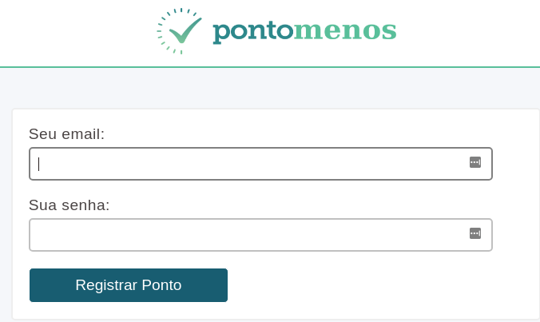

pontomenos
---

> Frontend para registrar o ponto no pontomais.com.br inserindo uma localidade falsa. 



### Motivação

O app mobile do pontomais é horrível. Lento, feio e impreciso em relação à posição do GPS.

Com o pontomenos você ganha mais agilidade, economiza tempo e fica menos irritado naquele momento alegre de bater o ponto. E se você dá valor ao seu tempo, pode simplesmente configurar um agendador de tarefas para bater o ponto por você, funcionário pontual. =)

### Compilando

Criando o binário `main`:

```sh
image="gustavohenrique/pontomenos"
docker run --rm -v ${PWD}:/code ${image} sh -c 'cd /code \
 && apk add --update git \
 && go get github.com/gin-gonic/gin \
 && go get github.com/gin-contrib/cors \
 && go get github.com/parnurzeal/gorequest \
 && go build main.go'
```

### Executando

```sh
chmod +x main
./main
```

ou via Docker:

```sh
docker build -t=pontomenos .
docker run -d -e PORT=7000 -p 7000:7000 pontomenos
```

### Utilizando

Há 2 maneiras de utilizar:

- Frontend: altere a URL no arquivo `script.js` para http://localhost:7000 e abra o `index.html` no browser.
- Terminal: `curl -XPOST -d '{"email":"me@company.com", "password":""}' http://localhost:7000`

### Licença

MIT

